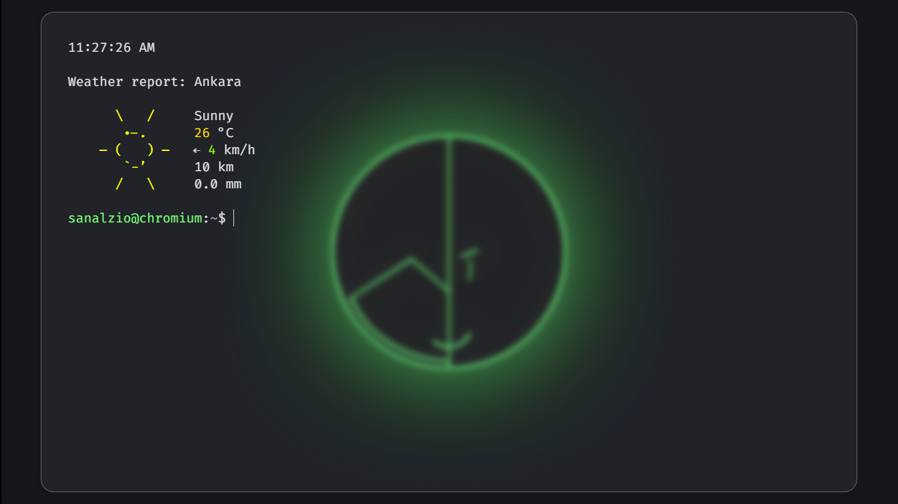

# termPage

My custom like terminal home page.

### > [Click to visit demo ▶](https://sanalzio.github.io/termPage/src/index.html) <

<br>



## Installation

1) Download source code.
2) Copy `src` folder from source code to indelible place.
3) Visit `chrome://extensions` url with chromium based browser.
4) Switch on the `Developer mode` option.
5) Click to `Load unpacked` button.
6) Select copied `src` folder.
7) Open new tab.
8) Select `keep it` option.

## Customization

### Terminal settings

Edit `terminal_settings` dictionary in `manifest.json` like this:

```json
    "terminal_settings": {

        // Page title
        "title": "New Tab",

        // Custom favicon path like "./assets/icon.png". null for disable favicon.
        "tab_favicon": null,

        // user name for command preffix
        "user": "sanalzio",

        // host name for command preffix
         // types: null or string:
          // null for detect browser type auto
        "host": "brave", // null,

        // search engine for "seach" command
         // replace "$&" with query required place
        "search-engine-url": "https://duckduckgo.com/?q=$&",

        // location for "wttr.in" command
        "location": "Ankara",
        /*
         * "Ankara"              # city name
         * "~Eiffel+tower"       # any location (+ for spaces)
         * "Москва"              # Unicode name of any location in any language
         * "esb"                 # airport code (3 letters)
         * "@stackoverflow.com"  # domain name
         * "06800"               # area codes
         * "-78.46,106.79"       # GPS coordinates
         */

        // language for "wttr.in" command
        "language": "en",

        // enable execute "load.sh" on load
        "allowLoadScript": false,

        // enable set effective time on load
        "effectiveTime": false,

        // set default clock format
         // 12 or 24 only
          // 12 = 11:59 AM
          // 24 = 23:59
        "timeHours": 12,

        // save history to localStorge and remeber old history
        "remebmerHistory": false,

        // terminal color theme
        "color_scheme": "dark"
    },
```

### Bookmarks

Edit `bookmarks` dictionary in `manifest.json`.

### Search Engines

Custom search engines allows `seacrh -b -yt search query` and `seacrh -yt search query` like usage.

Edit `search_engines` dictionary in `manifest.json` like this:

```json
"search_engines": {
    "yt": "https://www.youtube.com/results?search_query=$&",
    "dd": "https://devdocs.io/#q=$&",
    "g": "https://www.google.com/search?q=$&"
},
```

> [!IMPORTANT]
> replace `$&` with query required place in custom search engines.

### Aliases

For comand aliases. Edit `aliases` dictionary in `manifest.json` like this:

```json
"aliases": {
    "cls": "clear",
    "?": "help",
    "wttr": "wttr.in",
    "reboot": "reload",
    "shutdown": "close",
    "js": "javascript",
    "lzar": "calc",
    "ip": "ipinfo",
    "ipconfig": "ipinfo"
},
```

### Themes

Optional theme `.css` files. Edit `themes` dictionary in `manifest.json` like this:

```json
"themes": [
    "./themes/glass.css",
    "./themes/custom-background.css"
]
```

## How to add custom background

1) Add `custom-background.css` theme file into `themes` dictionary in `manifest.json` like this:

    ```json
    "themes": [
        ...
        "./themes/custom-background.css"
    ]
    ```

2) Edit second line of `/themes/custom-background.css` file like this:

    ```css
    --html-background: url("../wallpaper/sanalzio/neon-green.png");
    ```

    > [!IMPORTANT]
    > Add `../` to background file path.

## License

GNU GENERAL PUBLIC LICENSE<br>
&emsp;&emsp;Version 3,  29 June 2007