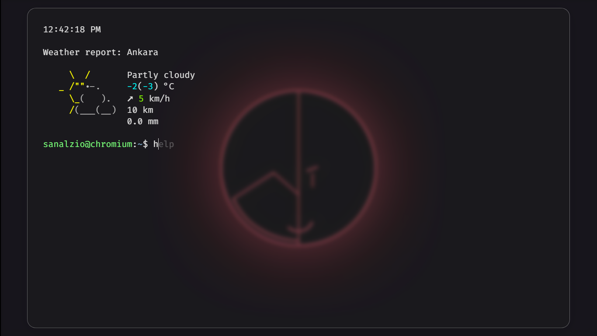

# termPage

My custom like terminal home page.

### > [Click to visit demo ▶](https://sanalzio.github.io/termPage/src/index.html) <

<br>



## Installation

1) Download source code.
2) Copy `src` folder from source code to indelible place.
3) Visit `chrome://extensions` url with chromium based browser.
4) Switch on the `Developer mode` option.
5) Click to `Load unpacked` button.
6) Select copied `src` folder.
7) Open new tab.
8) Select `keep it` option.

## Customization

### Terminal settings

Edit `settings.json` like this:

```json

    // Page title
    "title": "New Tab",

    // Custom favicon path like "./assets/icon.png". null for disable favicon.
    "tab_favicon": null,

    // user name for command preffix
    "user": "username",

    // host name for command preffix
        // types: null or string:
        // null for detect browser type auto
    "host": null, // "chrome"

    // search engine for "seach" command
        // replace "$&" with query required place
    "search_engine_url": "https://duckduckgo.com/?q=$&",

    // location for "wttr.in" command
    "location": "New York",
    //  * "New York"            # city name
    //  * "~Eiffel+tower"       # any location (+ for spaces)
    //  * "Москва"              # Unicode name of any location in any language
    //  * "esb"                 # airport code (3 letters)
    //  * "@stackoverflow.com"  # domain name
    //  * "06800"               # area codes
    //  * "-78.46,106.79"       # GPS coordinates


    // language for "wttr.in" command
    "language": "en",

    // enable execute "load.sh" on load
    "allow_load_script": false,

    // enable set effective time on load
    "effective_time": false,

    // set default clock format
        // 12 or 24 only
        // 12 = 11:59 AM
        // 24 = 23:59
    "time_hours": 12,

    // save history to localStorge and remeber old history
    "remebmer_history": false,

    // enable terminal like copy/paste system
    "enable_terminal_like_copy_paste": false,

    // enable auto complete system
    "enable_auto_complete": true,

    // check for updates on load (needs "modules/check-for-updates.js" file)
    "check_for_updates_on_load": true,

    // terminal color theme ("dark", "light" or "system")
    "color_scheme": "system"

    "allow_smooth_scroll": true,

    // Offers suggestions from the history.
    "suggest_from_history": true,

    ...
```

### Bookmarks

Edit `bookmarks` in `settings.json`.

### Search Engines

Custom search engines allows `seacrh -yt search query` like usage.

Edit `search_engines` in `settings.json` like this:

```json
"search_engines": {
    "yt": "https://www.youtube.com/results?search_query=$&",
    "dd": "https://devdocs.io/#q=$&",
    "g": "https://www.google.com/search?q=$&"
},
```

> [!IMPORTANT]
> replace `$&` with query required place in custom search engines.

### Aliases

For comand aliases. Edit `aliases` in `settings.json` like this:

```json
"aliases": {
    "cls": "clear",
    "?": "help",
    "wttr": "wttr.in",
    "reboot": "reload",
    "shutdown": "close",
    "js": "javascript",
    "lzar": "calc",
    "ip": "ipinfo",
    "ipconfig": "ipinfo"
},
```

### Themes

Optional theme `.css` files. Edit `themes` in `settings.json` like this:

```json
"themes": [
    "./themes/glass.css",
    "./themes/custom-background.css",
    "./themes/fira-code-font.css",

    // or like this
    {
        "path":"./themes/example.css",
        "media":"(prefers-color-scheme: light)",
        "colorScheme":"light"
    }
]
```

## How to add custom background

1) Add `custom-background.css` theme file into `themes` in `settings.json` like this:

    ```json
    "themes": [
        ...
        "./themes/custom-background.css"
    ]
    ```

2) Edit second line of `/themes/custom-background.css` file like this:

    ```css
    --html-background: url("../wallpaper/sanalzio/neon-green.png");
    ```

    > [!IMPORTANT]
    > Add `../` to background file path.

## How to add custom command

1) Create like `new-file.js` named file in `src/modules/` folder.

    ```js
    addCommand (
        "example", // command name

        // command operations
        async function (process, isInput = false) {
            stdout.log("Example command!");
            return 0;
        },

        // options
        {
            // about this command
            about: "Example module command. %ALIASES%",

            // command aliases
            aliases: ["ex", "exam"],

            // operations before exit
            beforeExit: async function (keyboardInput, error = false) {
                stdout.log(error ? "Error." : keyboardInput ? "Keyboard input." : "Normal exit.");
            }
        }
    );
    ```
2) Add `"new-file.js"` to `settings.modules`

    ```json
    "modules": [
        ...
        "new-file.js"
    ]
    ```

## Fixing `calc` and `javascript` commands

Change `"manifest_version"` option to `2` in `manifest.json` file.

## License

GNU GENERAL PUBLIC LICENSE<br>
&emsp;&emsp;Version 3,  29 June 2007